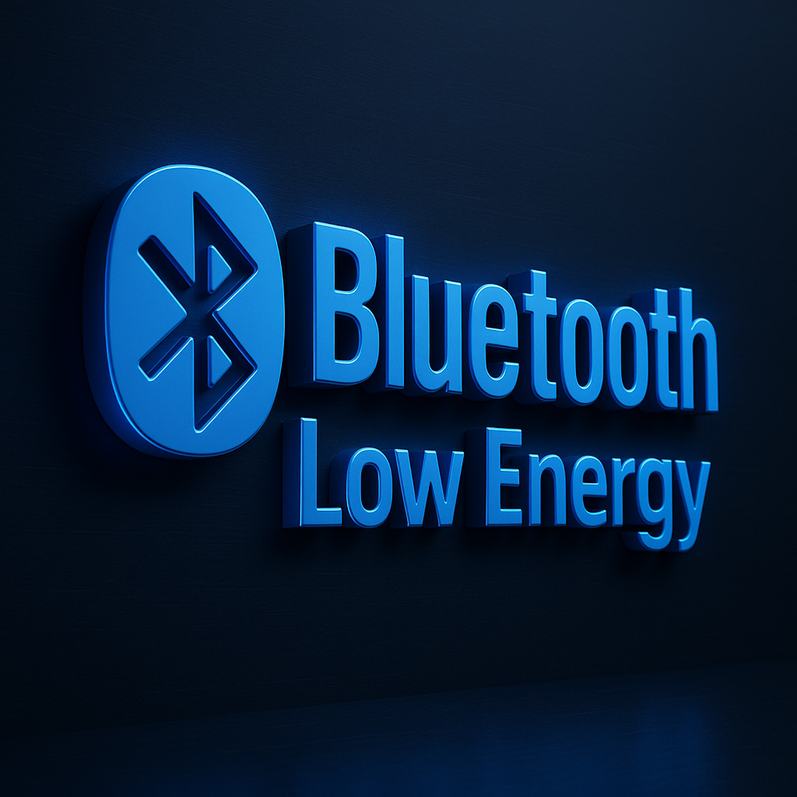

<p align="center">
  
</p>

<p align="center">
  <a href="https://discord.gg/your-invite">
    
  </a>
</p>

# Bluetooth Dual-Mode Power Management (ESP32)

[](LICENSE)


**Goal:** Keep Bluetooth **always on** without excess drain.  
**How:** Idle = **BLE** with long advertising intervals & low TX power.  
On interest/traffic = tighten connection params, **boost TX power**, and optionally start **Classic SPP** for maximum robustness/throughput.  
On inactivity = gracefully fall back to low-power BLE.

---

## Table of Contents
1. [Features](#features)
2. [System Design](#system-design)
3. [Power Strategy & Defaults](#power-strategy--defaults)
4. [Build & Flash](#build--flash)
5. [Usage](#usage)
6. [Tuning Guide](#tuning-guide)
7. [API: GATT Service & Control](#api-gatt-service--control)
8. [Project Structure](#project-structure)
9. [Troubleshooting](#troubleshooting)
10. [FAQ](#faq)
11. [Roadmap](#roadmap)
12. [License](#license)
13. [Contact](#contact)

---

## Features

- **Ultra-low idle power**
  - BLE advertising ~**1 s** interval, **−24 dBm** TX power
  - CPU **light sleep** & dynamic frequency scaling
- **Adaptive discovery**
  - Button press or scan interest → **probe mode** (advertising ~**100 ms**)
- **Strong active link**
  - Tight BLE connection intervals **7.5–15 ms**
  - **+9 dBm** TX power in ACTIVE
  - Optional **Classic SPP** server for robust/high-duty sessions
- **Auto fallback**
  - Inactivity (default **15 s**) → relax params, stop SPP, return to idle advertising
- **Activity aware**
  - Promotes to ACTIVE when **≥256 B** received within **3 s** window

---

## System Design

```text
            ┌──────────────┐
   Idle     │  BLE Adv     │  ~1s, -24 dBm
            └──────┬───────┘
                   │ Button/Scan interest
                   ▼
            ┌──────────────┐
   Probe    │  BLE Adv     │  ~100ms, -24 dBm
            └──────┬───────┘
                   │ Connection + traffic or BOOST_ON
                   ▼
            ┌────────────────────────────┐
   Active   │  BLE 7.5–15ms, +9 dBm      │
            │  + optional Classic SPP    │
            └──────┬─────────────────────┘
                   │ Inactivity timeout
                   ▼
                  Idle
````

**Modes**

* **IDLE:** Discoverable, minimal drain
* **PROBE:** Temporarily easier to find/connect
* **ACTIVE:** Low latency, strong signal, optional SPP

---

## Power Strategy & Defaults

| Mode   | BLE Adv Interval | BLE Conn Interval      | Conn Latency | Supervision Timeout | TX Power | Classic  |
| ------ | ---------------- | ---------------------- | ------------ | ------------------- | -------- | -------- |
| Idle   | \~1000 ms        | N/A                    | N/A          | N/A                 | −24 dBm  | Off      |
| Probe  | \~100 ms         | N/A                    | N/A          | N/A                 | −24 dBm  | Off      |
| Active | N/A              | 7.5–15 ms (6–12 ticks) | 0            | 4 s                 | +9 dBm   | Optional |

**Promotion/Demotion**

* **Promote**: Data activity ≥ **256 B** within **3 s**, or explicit `BOOST_ON`
* **Demote**: No traffic for **15 s** → PROBE/IDLE; `BOOST_OFF` stops SPP

---

## Build & Flash

**Prereqs**

* ESP-IDF **5.x** (or recent 4.x with Bluedroid + SPP)
* ESP32 dev board (e.g., WROOM/WROVER)

```bash
idf.py set-target esp32
idf.py build
idf.py -p /dev/ttyUSB0 flash monitor
```

> Logs show mode switches, advertising/connection events, and SPP status.

---

## Usage

### BLE (default)

* Device name: **`ESP32-LOWPOWER-HYBRID`**
* GATT service UUID: **`0xABF0`**

  * **RX `0xABF1`**: Write to send data to ESP32 (counts toward activity)
  * **TX `0xABF2`**: Notifications; device echoes RX for demo
  * **CTL `0xABF3`**: Write ASCII control commands:

    * `BOOST_ON` → Enter ACTIVE, max TX power, start Classic SPP
    * `BOOST_OFF` → Stop SPP, relax back to PROBE/IDLE

### Classic SPP (optional “boost”)

* Device name: **`ESP32-SPP-BOOST`** (appears after `BOOST_ON`)
* Standard RFCOMM socket; demo echoes received bytes

### Button (GPIO0 / BOOT)

* Press to temporarily enter **PROBE** (faster advertising)

---

## Tuning Guide

All knobs are in `main/main.c`:

* **Advertising**

  * Idle: `adv_params_idle.adv_int_min/max` (units = 0.625 ms; **1600 ≈ 1 s**)
  * Probe: `adv_params_probe.adv_int_min/max` (**160 ≈ 100 ms**)
* **Connection (BLE)**

  * Active: `CONN_ITVL_MIN_ACTIVE=6` (7.5 ms), `MAX=12` (15 ms)
  * Save: `CONN_ITVL_MIN_SAVE=80` (100 ms), `MAX=200` (250 ms), `LATENCY=4`
* **TX Power**

  * Idle: `set_tx_power_idle()` → `ESP_PWR_LVL_N24`
  * Active: `set_tx_power_active()` → `ESP_PWR_LVL_P9`
* **Promotion/Demotion**

  * Activity window: `ACTIVITY_WINDOW_MS` (default 3000)
  * Threshold bytes: `ACTIVITY_BYTES_THRESH` (default 256)
  * Inactivity timeout: `INACTIVITY_MS` (default 15000)
* **User input**

  * Button pin: `GPIO_BTN` (default 0)

**Tips**

* Latency-sensitive HID: raise Active interval upper bound slightly (12→18)
* Sensor/beacon: loosen Save intervals (e.g., 200→400) for more savings
* Range issues: keep Active +9 dBm; consider PROBE at −12 dBm instead of −24 dBm

---

## API: GATT Service & Control

**Service:** `0xABF0`

| Characteristic | UUID     | Props              | Direction       | Notes                          |
| -------------- | -------- | ------------------ | --------------- | ------------------------------ |
| TX             | `0xABF2` | Read, Notify       | ESP32 → Central | Enable notifications on client |
| RX             | `0xABF1` | Write, Write NoRsp | Central → ESP32 | Payload counts toward activity |
| CTL            | `0xABF3` | Write              | Central → ESP32 | `BOOST_ON`, `BOOST_OFF`        |

**Behavior**

* Any RX write increments activity window; TX echoes for demo.
* CTL commands switch modes and start/stop SPP.

---

## Project Structure

```
bt_dual_mode_pm/
├─ CMakeLists.txt
├─ sdkconfig.defaults
└─ main/
   ├─ CMakeLists.txt
   └─ main.c
```

* `sdkconfig.defaults` enables Bluetooth (BLE + Classic), Bluedroid, PM, and reduces log noise.
* `main.c` implements GAP/GATT, SPP, timers, mode state machine, and power control.

---

## Troubleshooting

**Device not discovered**

* Verify advertising started (log: “Advertising start…”).
* Temporarily switch to **PROBE** (button press) to shorten adv interval.
* Ensure phone/host supports BLE and is scanning.

**Disconnects / weak link**

* Keep ACTIVE at **+9 dBm**.
* Increase **supervision timeout** (e.g., 4 s → 6–8 s).
* Consider raising Active interval max (12→18) if collisions/congestion.

**SPP doesn’t appear**

* You must send `BOOST_ON` via CTL first (SPP starts dynamically).
* Some OSes require pairing before SPP shows; remove/forget old pairing.

**High idle current**

* Confirm you’re in **IDLE** (logs).
* Check `adv_params_idle` \~1 s; ensure TX power is **N24**.
* Make sure **tickless idle** and **light sleep** are enabled in config.

---

## FAQ

**Q: Can I use NimBLE instead of Bluedroid?**
A: Yes—port the GATT parts to NimBLE. For SPP you’ll still need BR/EDR (Classic) support; keep dual-mode controller enabled.

**Q: Can I do A2DP instead of SPP for audio?**
A: Yes, swap SPP init for A2DP sink/source. Expect higher duty cycle and power use while streaming.

**Q: Can this run on nRF52/Zephyr?**
A: Conceptually yes. Recreate the three-state machine (IDLE/PROBE/ACTIVE), map to Zephyr’s `bt_le_adv_param`, connection parameter updates, and power levels.

**Q: How do I make it “always on” but nearly zero drain?**
A: Stretch idle advertising to 2–5 s, keep −24 dBm TX, and rely on **PROBE** on user input or scheduled windows.

---

## Roadmap

* Optional **RSSI-based adaptive TX power** during ACTIVE
* **Zephyr/NimBLE** reference port
* **Config over GATT** (change intervals/power from client)
* **Metrics characteristic** (expose bytes/s, mode, RSSI)

---

## License

This project is licensed under the **MIT License**. See [LICENSE](LICENSE).

---

## Contact

* **Author:** R\&D Biotech Alaska
* **Email:** [contact@rdbiotechalaska.com](mailto:contact@rdbiotechalaska.com)
* **GitHub:** [https://github.com/R-D-BioTech-Alaska](https://github.com/R-D-BioTech-Alaska)
